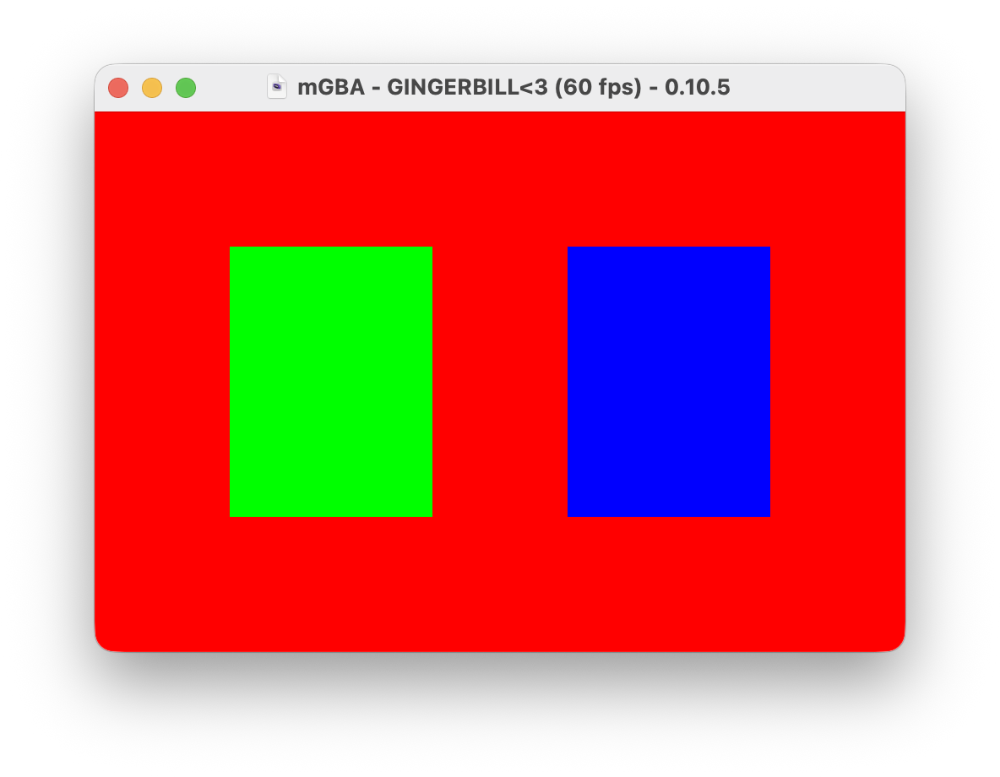

# odin-gba

A minimal way to build a GBA ROM using [Odin](https://odin-lang.org/).



To actually build an executable GBA rom, the steps are (as of Odin `dev-2026-07`):

- build a freestanding ARM7TDMI ojbect with `odin build`
  - preferrably using `target-features:thumb-mode` for smaller size
  - use `-bedrock` for a stricter set of allowed features
- link the object to a stubbed startup program ([tools/rsrt0.s](./tools/rsrt0.s))
  - use gc-sections to limit executable size
- use a linker script that sets correct memory regions
- patch the GBA header with the `odin-gba header` command
  - this sets the header according to GBATEK's docs

## Building

```sh
odin run tools -- build example
```

The example produces `build/odin-gba-example.gba`. To build the CLI once and use it separately:

```sh
odin build tools -out:build/odin-gba
build/odin-gba build example
```

## Requirements

Odin `dev-2026-07` (with `-bedrock` flag)

[GNU Arm Embedded toolchain](https://developer.arm.com/tools-and-software/gnu-toolchain#Downloads), for the following:

- `arm-none-eabi-as` for assembler code
- `arm-none-eabi-ar` for archiving SDK and runtime objects
- `arm-none-eabi-gcc` for compile/linking
  - current odin fails to cross-compile/link for freestanding arm32
  - also needed for the linker script lifted from [min-gba](https://github.com/rust-console/min-gba)
- `arm-none-eabi-nm` for validating the exported `gba_main` symbol
- `arm-none-eabi-objcopy` for converting ELF to GBA rom

To install the ARM toolchain:

- MacOS: `brew install --cask gcc-arm-embedded`
- Windows: TODO
- Ubuntu/Debian: TODO
