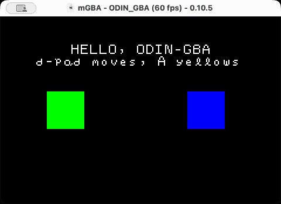

# odin-gba

Tools and utilities to build basic GBA ROMs using [Odin](https://odin-lang.org/).

Most functionality besides some basic mode 3 rendering and input is missing, but that's enough for some simple demos like:

 <p align="center">
    
    <br>
    <sub>Example ROM running in mGBA on MacOS</sub>
  </p>

To actually build an executable GBA rom, the steps are (as of Odin `dev-2026-07`):

- build a freestanding ARM7TDMI ojbect with `odin build`
    - preferrably using `target-features:thumb-mode` for smaller size
    - use `-bedrock` for a stricter set of allowed features
- link the object to a stubbed startup program ([tools/gba_runtime.s](./tools/gba_runtime.s))
    - use gc-sections to limit executable size
- use a linker script that sets correct memory regions
- patch the GBA header with the `odin-gba header` command
    - this sets the header according to GBATEK's docs

## Building the example ROM

Generate packed assets (debug font):

```sh
odin run tools -- assetpack assets/font.png
```

Build the example:

```sh
odin run tools -- build example
Build succeeded!
  ROM:        build/odin-gba-example.gba
  Size:       2076 bytes (2.03 KiB, 0.0062% of 32 MiB)
  Header:     ODIN_GBA / NICE / 00
  Build time: 279.890292ms
```

The example produces `build/odin-gba-example.gba`, header metadata is defined in [manifest.json](./example/manifest.json).

## Requirements

Odin `dev-2026-07` (with `-bedrock` flag).

[GNU Arm Embedded toolchain](https://developer.arm.com/tools-and-software/gnu-toolchain#Downloads), for the following:

- `arm-none-eabi-as` for assembler code
- `arm-none-eabi-ar` for archiving SDK and runtime objects
- `arm-none-eabi-gcc` for compile/linking
    - current odin fails to cross-compile/link for freestanding arm32
    - also needed for the linker script lifted from [min-gba](https://github.com/rust-console/min-gba)
- `arm-none-eabi-nm` for validating the exported `gba_main` symbol
- `arm-none-eabi-objcopy` for converting ELF to GBA rom

To install the ARM toolchain:

- MacOS: `brew install --cask gcc-arm-embedded`
- Ubuntu/Debian: `sudo apt install gcc-arm-none-eabi binutils-arm-none-eabi`
- Windows: Grab [official installers](https://developer.arm.com/tools-and-software/gnu-toolchain#Downloads) and ensure they are in your `PATH`
